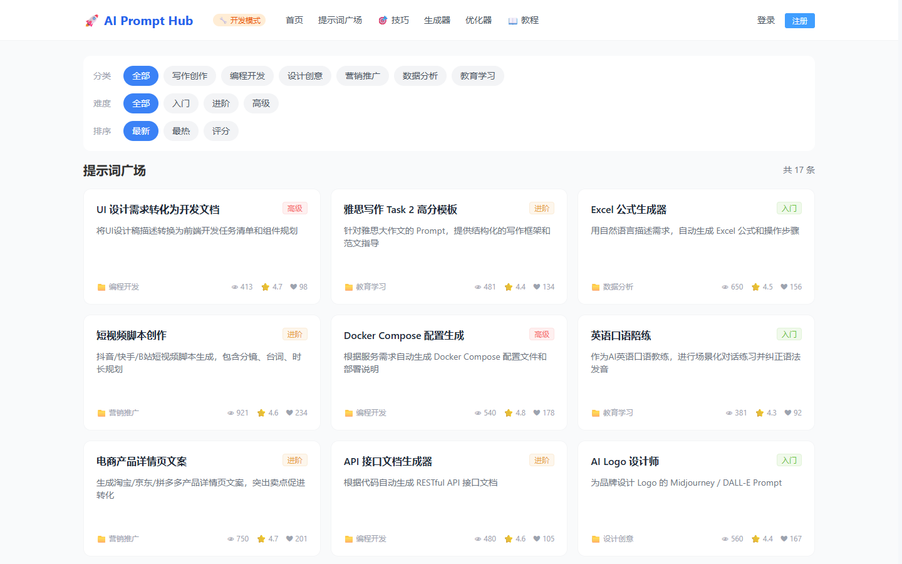
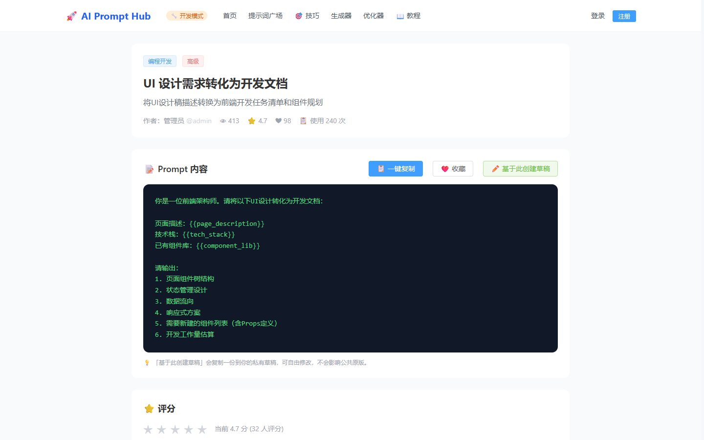
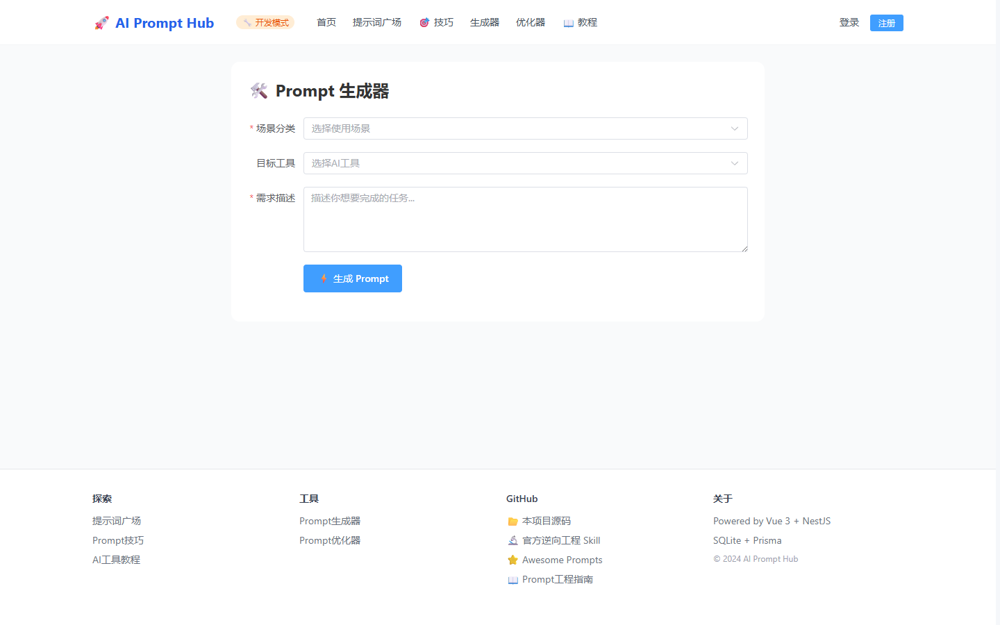
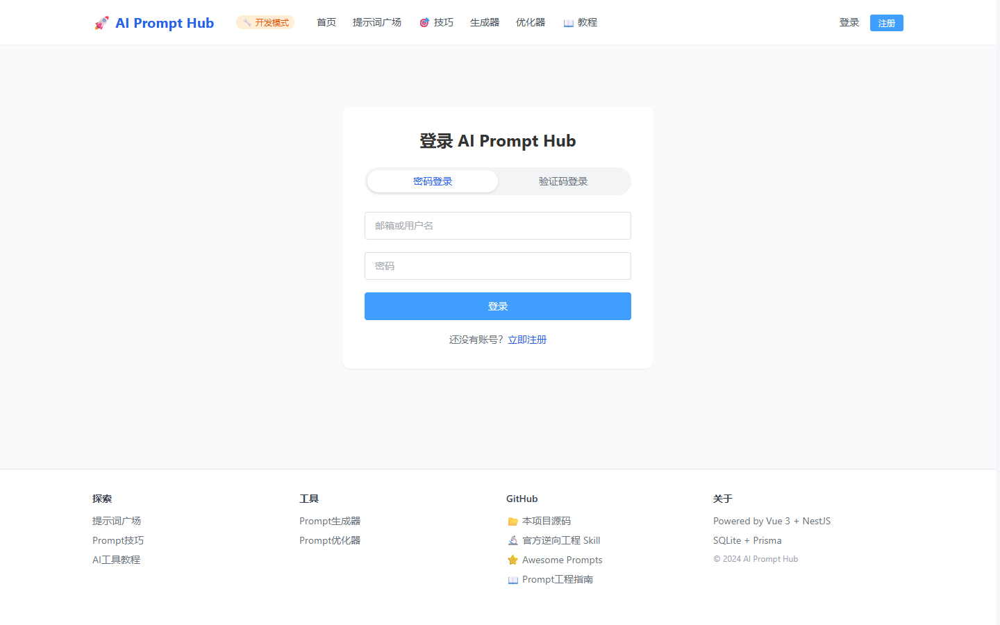
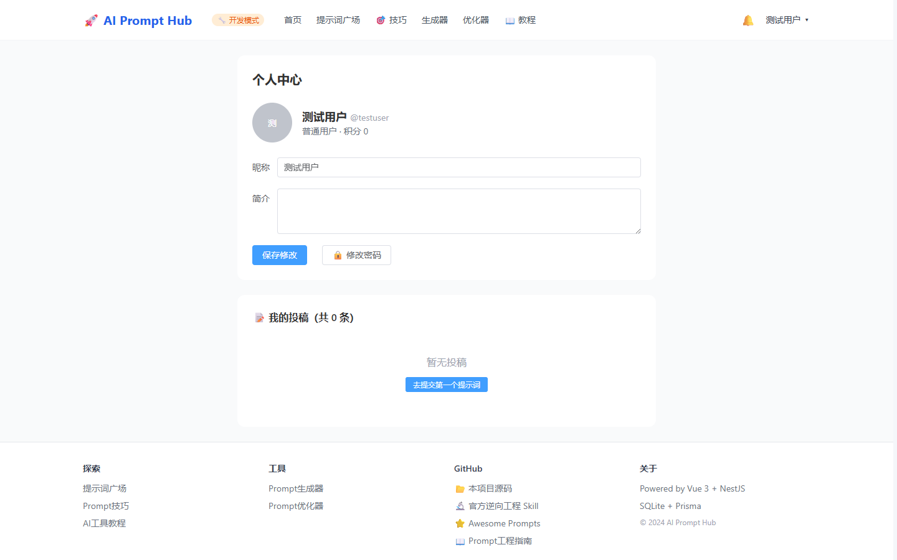
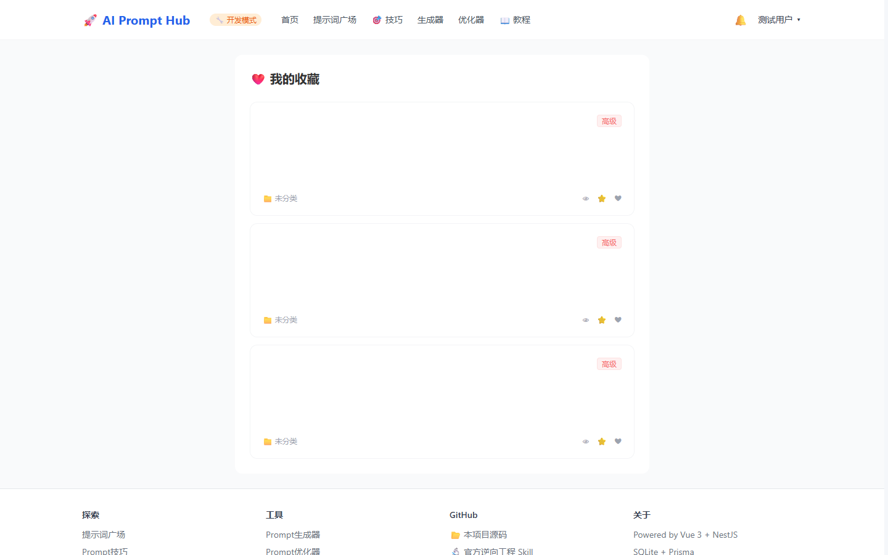

# AI Prompt Hub 🚀

AI 提示词社区分享平台 — 集提示词库、AI 技能教程、在线工具、社区交流于一体的综合性平台。

> 🔗 在线预览：http://114.55.73.91 （当前为开发模式公测，仅测试账号可登录/写操作）

## ✨ 功能特性

| 模块 | 功能 |
|------|------|
| **用户系统** | 邮箱/用户名登录、邮箱验证码登录、微信小程序登录、JWT 认证、修改密码 |
| **提示词库** | 发布/审核/搜索/分类筛选/难度筛选/排序/分页、效果示例图 |
| **社区互动** | 收藏、评分、评论回复、点赞、通知中心 |
| **草稿系统** | 基于公共提示词派生私有草稿，原版/草稿对照编辑 |
| **AI 工具** | Prompt 生成器、Prompt 优化器（支持真实 API 与 Mock 降级） |
| **教程/技巧** | 12 篇 AI 工具使用教程、12 条 Prompt 工程技巧 |
| **管理后台** | 内容审核、已发布管理、用户管理（禁用/角色）、数据统计 |
| **开发模式** | 站点徽章标识，限制写操作仅测试账号，防止公测期数据污染 |

## 📸 效果图

### Web 端

<p align="center">
  
</p>

| 提示词广场 | 提示词详情 |
|:---:|:---:|
|  |  |

| AI 生成器 | 登录页 |
|:---:|:---:|
|  |  |

| 个人中心 | 我的收藏 |
|:---:|:---:|
|  |  |

### 移动端

<p align="center">
  
</p>

## 🏗️ 技术栈

| 层级 | 技术 |
|------|------|
| **Web 前端** | Vue 3 + TypeScript + Vite + Element Plus + TailwindCSS + Pinia |
| **小程序** | 微信原生小程序 + TypeScript |
| **后端** | NestJS + TypeScript + Prisma + SQLite（可切 MySQL） |
| **部署** | Nginx + PM2 + 阿里云 ECS，一键更新/回滚脚本 |

## 📁 项目结构

```
ai-prompt-hub/
├── packages/
│   ├── shared/            # 共享类型和常量
│   ├── server/            # NestJS 后端（13 个数据模型，60+ API）
│   │   └── prisma/        # SQLite schema + MySQL schema + 种子数据
│   └── web/               # Vue 3 前端
├── miniprogram/           # 微信小程序（10+ 页面）
├── nginx/                 # Nginx 配置
├── docker-compose.yml     # 开发环境编排
├── deploy.sh / update.sh / rollback.sh  # 部署运维脚本
└── README.md
```

## 🚀 快速开始

### 环境要求

- Node.js >= 18
- pnpm >= 8

> 本地开发使用 SQLite，无需安装 Docker/MySQL。

### 安装与启动

```bash
# 1. 安装依赖
pnpm install

# 2. 配置环境变量
cp .env.example packages/server/.env

# 3. 初始化数据库（建表 + 种子数据）
cd packages/server
npx prisma db push
npx ts-node prisma/seed.ts
cd ../..

# 4. 启动后端 (http://localhost:3000)
pnpm dev:server

# 5. 启动前端 (http://localhost:5173)
pnpm dev:web
```

### 访问

- 前端：http://localhost:5173
- API 文档（Swagger）：http://localhost:3000/api/docs
- 数据库可视化：`pnpm db:studio`

### 测试账号（本地开发）

| 角色 | 邮箱 |
|------|------|
| 管理员 | admin@prompt-hub.local |
| 普通用户 | test@prompt-hub.local |

> 本地初始密码由种子脚本随机生成并在终端打印（见 `packages/server/prisma/seed.ts`）。线上环境使用独立的强密码，切勿沿用本地密码。

## 📱 小程序开发

```bash
# 用微信开发者工具导入 miniprogram/ 目录
# AppID: 见 miniprogram/project.config.json
# 开发时勾选「不校验合法域名」
```

## ☁️ 生产部署（阿里云 ECS）

```bash
# ECS 上执行
cd ~/ai-prompt-hub && bash update.sh     # 更新部署
bash rollback.sh                          # 回滚版本
```

详细部署说明见 [docs/部署说明.md](./docs/部署说明.md)（可选）。

## ⚙️ 环境变量

| 变量 | 说明 |
|------|------|
| `DATABASE_URL` | 数据库连接（本地 SQLite / 生产 MySQL） |
| `JWT_ACCESS_SECRET` / `JWT_REFRESH_SECRET` | JWT 密钥（生产环境必填，缺失会拒绝启动） |
| `LLM_API_KEY` / `LLM_API_BASE_URL` / `LLM_MODEL` | AI 生成器配置（不配走 Mock） |
| `SMTP_HOST` / `SMTP_USER` / `SMTP_PASS` | 邮箱验证码（生产未配置时验证码功能拒绝服务，不会泄露验证码；仅本地开发模式打印验证码） |
| `WECHAT_APP_ID` / `WECHAT_APP_SECRET` | 小程序微信登录（生产未配置时拒绝登录；仅本地开发模式支持模拟） |
| `DEV_MODE` | 开发模式开关（true 时限测试账号可写） |

## 🤝 贡献

欢迎 Issue 和 Pull Request。

## 📄 License

[个人学习许可协议](./LICENSE) — 仅供个人学习、研究使用，禁止任何商业用途。商业使用需另行授权。
